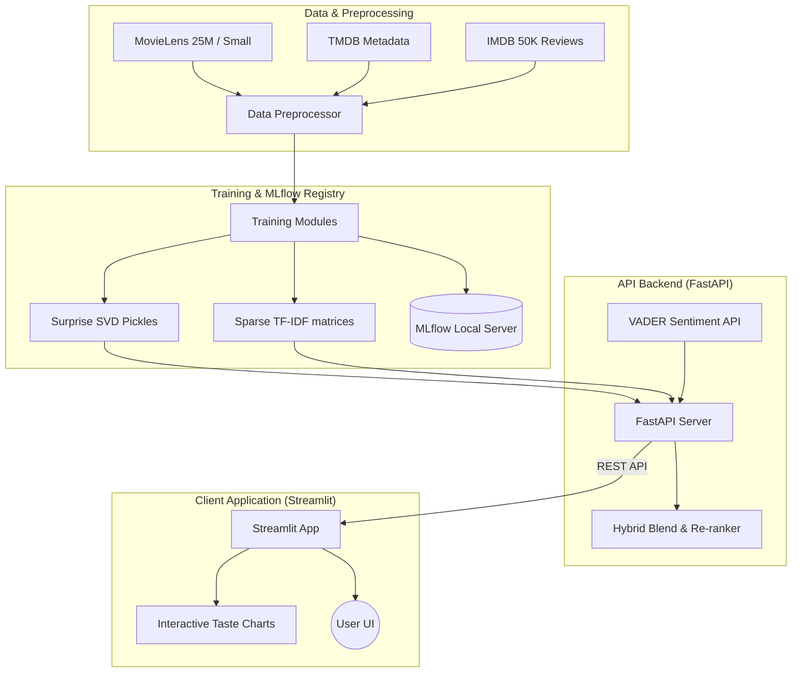

# CineIQ 🎬

### Explainable Hybrid Movie Recommendation Engine

Content discovery on modern streaming platforms is often opaque, biased toward promoted titles, and traps users in recommendation loops. **CineIQ** is an open, explainable recommendation system combining Collaborative Filtering, Content-Based Filtering, and Sentiment-Aware Re-ranking into an interactive, visual platform.

---

## 🚀 Key Features

* **Hybrid Recommendation Blender**: Blends user latent factors from **SVD Collaborative Filtering** with metadata similarities from **TF-IDF Content-Based Filtering**.
* **Sentiment-Aware Re-ranker**: Fetches recent reviews for candidate recommendations and adjusts ranking scores dynamically using natural language sentiment (VADER / DistilBERT).
* **Explainability Layer**: Generates human-friendly explanations for every recommended movie, informing the user of the exact genre matching, collaborative weight, and review sentiment metrics driving the suggestion.
* **Interactive Taste Analytics Dashboard**: Streamlit interface displaying genre radar charts, decade preferences, and actor/director affinities from rating history.
* **Experiment & Model Logging**: Full integration with **MLflow** for tracking training parameters, vocabulary sizes, and SVD model accuracy metrics.

---

## 🏗️ System Architecture



---

## 📁 Repository Structure

```
CineIQ/
├── .gitignore               # Excludes datasets, local models, and virtual environments
├── README.md                # Project home and documentation
├── requirements.txt         # Package dependencies
│
├── src/                     # Recommendation package source
│   ├── config.py            # Global variables, paths, and model weights
│   ├── data_pipeline.py     # Downloads datasets and extracts features
│   ├── sentiment.py         # Handles VADER and Hugging Face NLP scoring
│   ├── recommender.py       # Core hybrid scoring, re-ranking, and explanations
│   └── models/
│       ├── custom_svd.py    # Backup Funk SVD in case surprise installation fails
│       ├── train_content.py  # Fits TF-IDF on movie metadata
│       └── train_svd.py     # Fits SVD on user ratings
│
├── api/                     # Backend serving layer
│   └── main.py              # FastAPI endpoints (/recommend, /similar, /health)
│
└── app/                     # Frontend visualization layer
    ├── main.py              # Streamlit dashboard
    └── visualization.py     # Plotly polar/radar/bar charts
```

---

## 🛠️ Local Installation & Setup

We use **`uv`**, the extremely fast Python environment manager, to set up the project instantly.

### 1. Clone & Navigate
```powershell
git clone https://github.com/YOUR_USERNAME/CineIQ.git
cd CineIQ
```

### 2. Configure Python & Install Dependencies
Initialize a virtual environment and install all packages listed in `requirements.txt`:
```powershell
uv venv --python 3.11
uv pip install -r requirements.txt
```

### 3. Run Data Preprocessing & Model Training
Execute the modules to fetch datasets and train the recommender:
```powershell
# Downloads MovieLens data and preprocesses it
uv run python -m src.data_pipeline

# Trains the Content-Based TF-IDF model
uv run python -m src.models.train_content

# Trains the Collaborative Filtering SVD model
uv run python -m src.models.train_svd
```

---

## ⚡ How to Run the App

For a complete experience, launch both the backend serving layer and frontend dashboard:

### 1. Start the FastAPI Server
Open a terminal and start the backend:
```powershell
uv run python -m api.main
```
*The API is now running at:* [http://127.0.0.1:8000](http://127.0.0.1:8000)  
*Browse documentation and interactive test endpoints at:* [http://127.0.0.1:8000/docs](http://127.0.0.1:8000/docs)

### 2. Launch the Streamlit Dashboard
Open another terminal window and run:
```powershell
uv run streamlit run app/main.py --server.headless true
```
*Open your browser and navigate to:* [http://localhost:8501](http://localhost:8501)

---

## 📊 Dataset Settings (Scaling to Full 25M)
By default, the pipeline runs in **Development Mode** (`DEV_MODE = True` in `src/config.py`) using the **MovieLens Latest Small** dataset. This runs in seconds and requires minimal memory. 

To scale up to the full **MovieLens 25M** and custom Kaggle CSVs:
1. Open `src/config.py` and set:
   ```python
   DEV_MODE = False
   ```
2. Place your raw Kaggle metadata files (`tmdb_5000_movies.csv`, `tmdb_5000_credits.csv`) and `IMDB_Dataset.csv` into the `data/raw/` directory.
3. Re-run the data pipeline and training scripts.